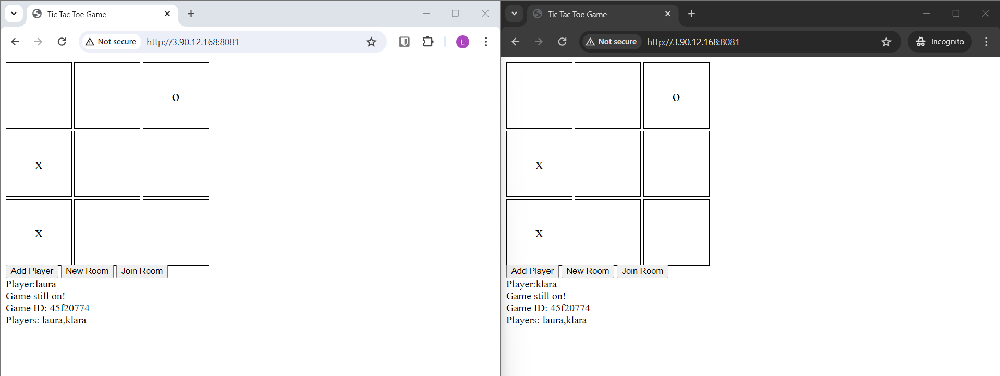

# Laura Šeatović - Terraform, EC2, TicTacToe report

- Course: *Cloud programming*
- Group: 3
- Date:

## How to Run

### 1. Deploying Infrastructure
Use Terraform to deploy resources on AWS. Clone the repository and navigate to the directory containing Terraform configuration files.
```sh
git clone https://github.com/lauraSeatovic/cloudTest.git
cd CloudTest
terraform init
terraform apply
```
### 2. Interacting with the app
- Once the infrastructure is deployed, you can access the app on the following address http://<public_ip>:8081
- To create a new room, click New Room
- To join an existing room, click Join Room
- After joining the room, if the game is not full, you can join the game by clicking Add player and entering your nickname

### 3. Cleaing up
After you have finished testing or using the infrastructure, use Terraform to shut down the resources.

```sh
terraform destroy
```

## Environment architecture

Architecture consists of two Docker containers deployed on AWS EC2 instance: the frontend, handling user interactions and interface elements, and the backend, managing server-side operations and game logic. Terraform is used for managing and deploying this infrastructure

## Preview

Screenshots of configured AWS services. Screenshots of your application running.




## Reflections

I learned how to configure infrastructure on AWS using Terraform and deploy Docker containers. Initially, I encountered difficulties with fetching code from a private GitHub repository. Eventually, I switched to using a public repository instead. Also, I encountered challenges with passing environment variables to Docker containers. In the end, with the help of online resources and by studying examples from other projects, I successfully managed to overcome these challenges.

